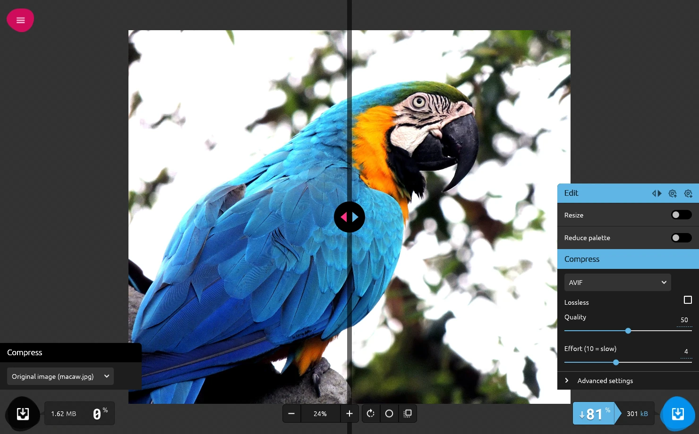
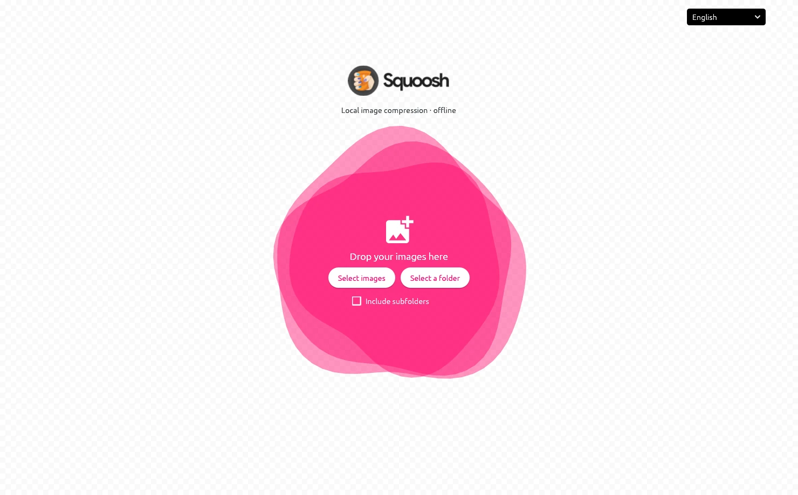
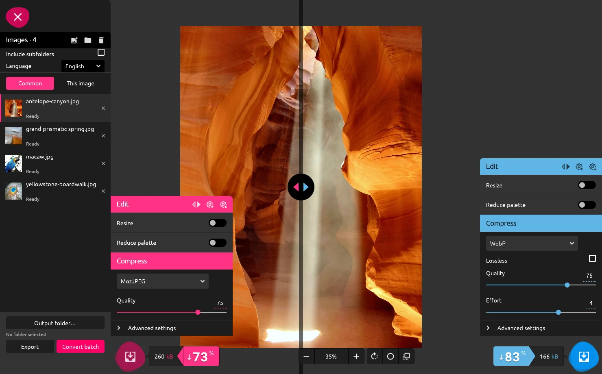
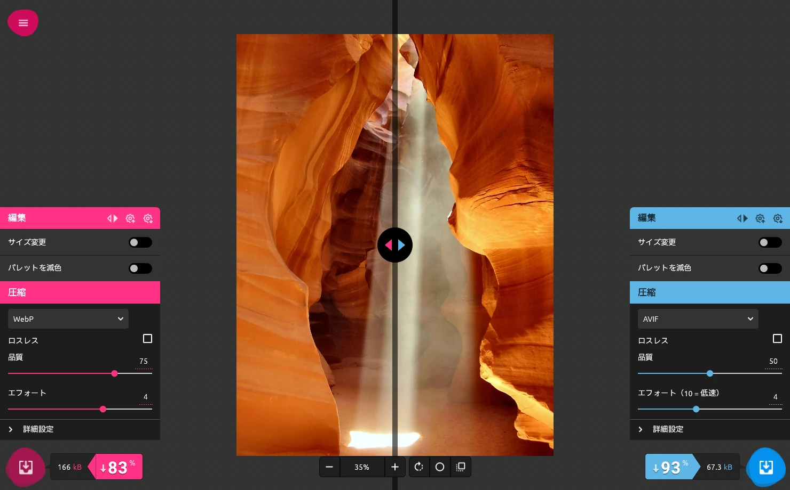

<div align="center">


# Squoosh Desktop

**Compress, compare and batch-convert images, entirely offline.**<br>
A native Rust port of [Squoosh](https://github.com/GoogleChromeLabs/squoosh) for Linux and Windows.<br>
**[hunter-gunter.github.io/squoosh-desktop](https://hunter-gunter.github.io/squoosh-desktop/)**

[](https://github.com/hunter-gunter/squoosh-desktop/actions/workflows/rust-linux.yml)
[](https://github.com/hunter-gunter/squoosh-desktop/actions/workflows/rust-windows.yml)
[](https://github.com/hunter-gunter/squoosh-desktop/releases)
[](LICENSE)
[](https://www.rust-lang.org)
[](#languages)

[](https://github.com/hunter-gunter/squoosh-desktop/releases/latest)
[](https://github.com/hunter-gunter/squoosh-desktop/releases/latest)
[](https://github.com/hunter-gunter/squoosh-desktop/releases/latest)
[](#packaging)



</div>

## What's new in 0.1.1

🌍 **Squoosh Desktop now speaks 17 languages**, from French and German to Chinese, Japanese and Korean, and follows your system language. See the [changelog](CHANGELOG.md) for details.

## Highlights

- 🔒 **Private by design**: everything runs on your machine. No telemetry and no network access while you work.
- 🖼️ **The Squoosh editor you know**: side-by-side comparison with a draggable divider, the same settings and the same look as [squoosh.app](https://squoosh.app).
- 🗜️ **Four encoders**: MozJPEG, OxiPNG, WebP (libwebp) and AVIF (libavif/AOM), with every advanced setting.
- ✂️ **Editing before compression**: resize (Lanczos3, Mitchell, Catmull-Rom, HQX, vector…) and palette reduction with dithering.
- 📚 **Batch conversion**: whole folders, shared settings with per-image exceptions, and no file ever overwritten.
- 🌍 **17 languages**: English, French, German, Spanish, Chinese, Japanese, Korean and more; the app follows your system language.
- 🐧🪟 **Native everywhere**: Debian 13 and Arch Linux (Wayland or X11), Windows 10 (1809) and 11, x86_64.

## Screenshots

<table>
  <tr>
    <td width="50%"></td>
    <td width="50%"></td>
  </tr>
  <tr>
    <td align="center"><b>Welcome screen</b>: drop images or pick a folder</td>
    <td align="center"><b>Image list</b>: MozJPEG vs WebP, ready for a batch</td>
  </tr>
  <tr>
    <td width="50%"></td>
    <td width="50%" valign="middle">
      <h3>🌍 17 languages</h3>
      The whole interface, including codec settings and error messages, is translated: English, Français, Deutsch, Español, Italiano, Português, Nederlands, Polski, Русский, Українська, Türkçe, Bahasa Indonesia, Tiếng Việt, 简体中文, 繁體中文, 日本語 and 한국어.
      See <a href="#languages">Languages</a>.
    </td>
  </tr>
</table>

## Install

Ready-made packages are attached to every [GitHub release](https://github.com/hunter-gunter/squoosh-desktop/releases), with their SHA-256 checksums.

| Platform | Package | How to install |
|---|---|---|
| **Windows 10/11** | `squoosh-desktop-<version>-windows-x64-setup.exe` | Run the installer. No administrator rights needed. |
| | `squoosh-desktop-<version>-windows-x64.zip` | Portable: unzip and run `squoosh-desktop.exe`. |
| **Debian 13** | `squoosh-desktop_<version>_amd64.deb` | `sudo apt install ./squoosh-desktop_*_amd64.deb` |
| **Any Linux** | `squoosh-desktop-<version>-x86_64.AppImage` | `chmod +x` it, then run it. |
| **Arch Linux** | `PKGBUILD` + source archive | See [Packaging](#packaging). |

> [!NOTE]
> The Windows binaries are not signed yet, so SmartScreen shows a warning on first launch.

## Usage

The interface follows [squoosh.app](https://squoosh.app): the image fills the window, the two settings panels float on the sides (pink on the left, blue on the right), and the view controls sit at the bottom.

1. **Add images**: drop files or folders on the window, or use the buttons. Tick *Include subfolders* to search folders recursively. Duplicate paths are ignored.
2. **Tune both sides**: each panel has an **Edit** section (*Resize*, *Reduce palette*) and a **Compress** section (codec, settings and folded *Advanced settings*). By default the left side shows the original image and the right side encodes AVIF at quality 50. The icons in the *Edit* header copy the settings to the other side, save them to a file or load them back.
3. **Compare**: drag the divider, drag the image to pan, use the mouse wheel to zoom. The bottom bar controls zoom, rotation, preview smoothing and the light or dark background; click the zoom percentage to fit the image. Previews are computed 300 ms after the last change.
4. **Read the result**: the bubble under each panel shows the output size and how much smaller or larger it is than the original.
5. **Export**: the round button next to the bubble picks that side and exports it to the output folder. The pink button in the top-left corner opens the **image list**, where you choose the output folder, export the selected image or convert the whole batch.

<details>
<summary><b>Batch conversion in detail</b></summary>

- *Common* settings apply to every image. Switch to *This image* to record exceptions for the selected image: only the fields you change are overridden, the others keep following the common settings. *Back to common settings* removes the exceptions.
- Settings are copied when a batch starts; later changes do not affect it.
- An error on one file does not stop the others. Each file shows its own status in the list.
- Cancelling waits for the current codec to return and keeps the files already written.
- Existing files are never overwritten: `photo.webp`, `photo_1.webp`, and so on. Each output is written to a temporary file in the output folder and only published once complete.

</details>

<details>
<summary><b>Platform notes</b></summary>

- **Windows**: drag and drop from Explorer works directly. Rendering uses Direct3D 12 (WARP when no GPU driver is present), with Vulkan or OpenGL as fallbacks; `WGPU_BACKEND=gl` forces OpenGL.
- **Linux**: native file dialogs use the desktop's file portal (`xdg-desktop-portal-gtk`, or `xdg-desktop-portal-kde` on KDE). Drag and drop goes through X11, so under Wayland the app starts through XWayland because winit does not support file drops on native Wayland. `SQUOOSH_WAYLAND=1` forces native Wayland, without drag and drop.

</details>

## Languages

Squoosh Desktop is available in **17 languages**:

| | | | |
|---|---|---|---|
| 🇬🇧 English | 🇫🇷 Français | 🇩🇪 Deutsch | 🇪🇸 Español |
| 🇮🇹 Italiano | 🇧🇷 Português (Brasil) | 🇳🇱 Nederlands | 🇵🇱 Polski |
| 🇷🇺 Русский | 🇺🇦 Українська | 🇹🇷 Türkçe | 🇮🇩 Bahasa Indonesia |
| 🇻🇳 Tiếng Việt | 🇨🇳 简体中文 | 🇹🇼 繁體中文 | 🇯🇵 日本語 |
| 🇰🇷 한국어 | | | |

The language is chosen in this order:

1. the `SQUOOSH_LANG` environment variable, for example `SQUOOSH_LANG=ja squoosh-desktop` (`en`, `fr`, `de`, `es`, `it`, `pt-BR`, `nl`, `pl`, `ru`, `uk`, `tr`, `id`, `vi`, `zh-CN`, `zh-TW`, `ja`, `ko`);
2. the language picked in the **language menu**, on the welcome screen or in the image list;
3. the system language, falling back to English.

The choice made in the menu is saved in `~/.config/squoosh-desktop/language` on Linux (or `$XDG_CONFIG_HOME`) and in `%APPDATA%\squoosh-desktop\language` on Windows. This is the only file the application writes outside the output folder.

Chinese, Japanese, Korean and Vietnamese use a font already installed on the system (for example Noto Sans CJK, Microsoft YaHei, Yu Gothic, Malgun Gothic or Noto Sans); nothing is bundled. The menu only lists the languages the system can display. Arabic, Hebrew, Persian and the Indic scripts are not offered yet, because egui does not shape complex scripts or lay out right-to-left text.

### Adding or improving a translation

Messages are written in English in the code (`t("…")`, `tr!("…", …)`) and in [`codecs/options.json`](codecs/options.json). Each language has a catalog in [`i18n/locales/`](i18n/locales), a JSON object that maps every English message to its translation:

```json
{
  "Add images": "Ajouter des images",
  "{} images in the list": "{} images dans la liste",
  "Error: {error}": "Erreur : {error}"
}
```

Keep the placeholders: `{}` for the next value, `{0}`, `{1}`… to reorder values, `{name}` for named values. To add a language, add a line to the `languages!` list in [`i18n/src/lib.rs`](i18n/src/lib.rs) and create its catalog. `cargo test -p squoosh-i18n` reports every missing, unused or malformed entry.

## Formats and limits

| | |
|---|---|
| **Input** | JPEG, PNG, WebP, AVIF, SVG, GIF, BMP, TIFF |
| **Output** | JPEG (MozJPEG), PNG (OxiPNG), WebP (libwebp), AVIF (libavif/AOM) |
| **Color** | SDR RGBA8 / sRGB pipeline, EXIF orientation applied, ICC profiles converted, other metadata removed |
| **Animations** | GIF and animated images: first frame only; TIFF: first page only (a message says so on import) |
| **Size** | 40 megapixels, 32,768 pixels per side, 512 MiB per source file, 100,000 paths per list |

- JPEG output gets a configurable white background for transparent pixels.
- External SVG resources are disabled; embedded images and system fonts are supported.
- An invalid format or profile produces an error for that file only.
- No animated, HDR or multi-page export.
- One image is processed at a time; AVIF uses up to four threads, WebP its native multithreaded mode. Up to 128 thumbnails are kept, and only the two selected previews stay on the GPU, split into 1,024-pixel tiles.
- Batches and exceptions are not restored after closing the app.

Every setting of the four formats is listed in the [settings mapping](docs/options.md). Browser-specific filters have documented native equivalents, without any promise of pixel-identical results or identical files. The *contain* mode of the original Squoosh code performs a center crop, and the native interface names it that way.

## Build from source

You need **Rust 1.95 or later**, a C compiler, NASM and pkg-config. MozJPEG is built by Cargo; libwebp, libavif with the AOM encoder and Little CMS are system libraries.

<details open>
<summary><b>Debian 13</b></summary>

```sh
sudo apt install build-essential pkg-config nasm libwebp-dev libsharpyuv-dev libavif-dev liblcms2-dev libxkbcommon-dev libxkbcommon-x11-0 libwayland-dev libx11-dev libx11-xcb-dev libxcb1-dev libegl1-mesa-dev libgl1-mesa-dev xdg-desktop-portal xdg-desktop-portal-gtk
```

</details>

<details open>
<summary><b>Arch Linux</b></summary>

```sh
sudo pacman -S --needed rust base-devel nasm libwebp libavif aom lcms2 libxkbcommon libxkbcommon-x11 wayland libx11 libxcb libglvnd xdg-desktop-portal xdg-desktop-portal-gtk
```

</details>

Then, from the repository root:

```sh
cargo run --release --locked -p squoosh-desktop
# Or open several files directly:
cargo run --release --locked -p squoosh-desktop -- image.png photo.jpg
```

The first build downloads the dependencies; the application itself never downloads anything.

<details>
<summary><b>Windows</b></summary>

You need Visual Studio 2022 Build Tools (the *Desktop development with C++* workload), Git, Rust 1.95 or later (target `x86_64-pc-windows-msvc`, rustup's default), NASM and Inno Setup 6:

```powershell
winget install Microsoft.VisualStudio.2022.BuildTools Git.Git Rustlang.Rustup NASM.NASM JRSoftware.InnoSetup
./scripts/windows.ps1 -Test
```

The script downloads vcpkg at a pinned revision into `target/vcpkg/`, builds libwebp, libavif/AOM and Little CMS as static libraries (`vcpkg.json`), runs the tests, then writes a portable archive and an installer to `target/dist/`. The executable needs no third-party DLL and no Visual C++ redistributable. For a plain `cargo build`, set `SQUOOSH_NATIVE_PREFIX` to `vcpkg_installed\x64-windows-static` after a first run of the script.

</details>

## Packaging

<details>
<summary><b>Debian package</b></summary>

On Debian 13, with `dpkg-dev` installed:

```sh
./scripts/deb.sh
sudo apt install ./target/dist/squoosh-desktop_*_amd64.deb
```

</details>

<details>
<summary><b>AppImage</b></summary>

Preferably built on Debian 13, since the glibc of the build machine sets the minimum version required. `appimagetool` needs the `file` command (`sudo apt install file`):

```sh
./scripts/appimage.sh
./target/dist/squoosh-desktop-*-x86_64.AppImage
```

The script downloads `linuxdeploy` and `appimagetool` (*continuous* builds) into `target/appimage-tools/`; the `LINUXDEPLOY` and `APPIMAGETOOL` variables point to local copies instead. libwebp, libavif/AOM and lcms2 are bundled; X11, Wayland and OpenGL come from the system.

</details>

<details>
<summary><b>Arch Linux package</b></summary>

Build the complete source archive and the Arch recipe with its checksum:

```sh
./scripts/source.sh
cd target/dist
makepkg -s
sudo pacman -U squoosh-desktop-*-x86_64.pkg.tar.zst
```

The recipe builds and tests from the local archive; nothing is published to the AUR.

</details>

<details>
<summary><b>Windows installer</b></summary>

`./scripts/windows.ps1` (see [Build from source](#build-from-source)) produces `squoosh-desktop-<version>-windows-x64.zip` (portable) and `squoosh-desktop-<version>-windows-x64-setup.exe`. The installer, available in twelve languages, installs for the current user without administrator rights (or for all users on request), adds a Start menu shortcut and offers the image formats in *Open with*, without changing the default application. Distribute the source archive with the binary; see [the notices](THIRD_PARTY.md).

</details>

<details>
<summary><b>Versioning and releases</b></summary>

The version is defined once, by `version` in the `[workspace.package]` section of `Cargo.toml`. The crates, the `--version` option, the Debian, AppImage and Arch packages, the source archive, the Windows executable and the installer all use it (`./scripts/version.sh` prints it). To publish a release, change that field, add an entry to [`CHANGELOG.md`](CHANGELOG.md), run `cargo check` to update `Cargo.lock`, commit, then push the matching tag:

```sh
git tag -a v0.1.1 -m "Squoosh Desktop 0.1.1"
git push origin v0.1.1
```

The `Release` workflow checks that the tag matches `Cargo.toml` and that `CHANGELOG.md` has an entry for that version, builds every package and publishes them with their SHA-256 checksums to GitHub Releases. The release notes are the changelog entry followed by a download table, then the notes GitHub generates (pull requests, contributors, full changelog link); preview them with `./scripts/release-notes.sh`. A pre-release tag (`v0.2.0-beta.1`) is published as a pre-release.

</details>

## Development

```sh
cargo test --workspace --locked
cargo clippy --workspace --all-targets --locked -- -D warnings
cargo fmt --all -- --check
cargo run --release --locked -p squoosh-core --example corpus -- target/corpus
```

CI runs the tests and builds the packages on Debian 13 (AppImage included), Arch and Windows (tests, Clippy, archive, installer and a check that no third-party DLL is needed). The tests cover the 32 format combinations, settings, filters, palettes, ICC/EXIF, exceptions, name collisions, errors, cancellation and batches of 100 images. The generated corpus is also used with independent decoders and for visual checks.

<details>
<summary><b>Regenerating the screenshots</b></summary>

The `screenshot` feature adds a capture mode: with `SQUOOSH_CAPTURE=shot.png`, the app saves its window once the previews are ready, then quits. `SQUOOSH_CAPTURE_FORMATS=jpeg,webp` picks the codecs of both sides and `SQUOOSH_LANG` the language. The photos are credited in [the notices](THIRD_PARTY.md#screenshot-photos).

```sh
cargo build --release --locked -p squoosh-desktop --features screenshot
SQUOOSH_LANG=en SQUOOSH_CAPTURE=editor.png target/release/squoosh-desktop macaw.jpg
```

</details>

<details>
<summary><b>Website</b></summary>

The website is a single static page per language, generated from [`site/`](site) with the Python standard library only. The texts live in `site/locales/<code>.json`, one file per app language, with the same keys as `en.json`. The [Website workflow](.github/workflows/pages.yml) publishes it on GitHub Pages on every change and after every release, with download links to the latest release.

```sh
python3 site/build.py                # writes target/site/
python3 -m http.server -d target/site
```

The screenshots are served as AVIF with a WebP fallback, in three widths: after changing one in `docs/screenshots/`, run `site/screenshots.sh` (ImageMagick and avifenc) to regenerate `site/assets/screenshots/`. `site/assets/og.png`, the social preview, is a capture of `site/assets/og.html` (the command is in the file).

</details>

### Repository layout

| Folder | Contents |
|---|---|
| [`app/`](app) | egui interface (`squoosh-desktop`) and its assets in `app/assets/` |
| [`core/`](core) | Conversion pipeline, settings, job queue and tests |
| [`codecs/`](codecs) | MozJPEG, OxiPNG, libwebp and libavif bindings, and the `options.json` registry |
| [`i18n/`](i18n) | Languages, translation catalogs (`locales/`) and helpers shared by every crate |
| [`packaging/`](packaging), [`scripts/`](scripts) | Arch recipe, `.desktop` file, Windows installer, package and AppImage builds |
| [`docs/`](docs) | Settings mapping with Squoosh, and screenshots |
| [`site/`](site) | Website generator, texts in 17 languages and assets |

## License

GPL-3.0-or-later (see [`LICENSE`](LICENSE)), because of imagequant. Code and assets taken from Squoosh remain under Apache-2.0 (see [`LICENSE-APACHE-2.0`](LICENSE-APACHE-2.0) and [the notices](THIRD_PARTY.md)).

<div align="center"><sub>Squoosh is a project by Google Chrome Labs. Squoosh Desktop is an independent port and is not affiliated with Google.</sub></div>
